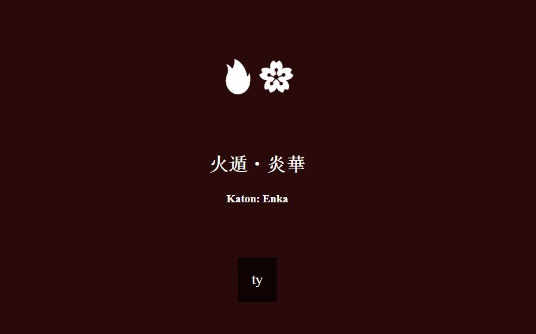

# Hz_Jutsus

Implementation of my jutsus API for a little game where you have to write out your jutsus and level up your character

🔥 - Use an element and learn more and more jutsus
💧 - Test yourself against others
⚡️ - Be the faster at making your jutsus
💨 - Fast paced game where you have to be the best in your element 
💩 - Points for the one that helps me find a rock emoji

